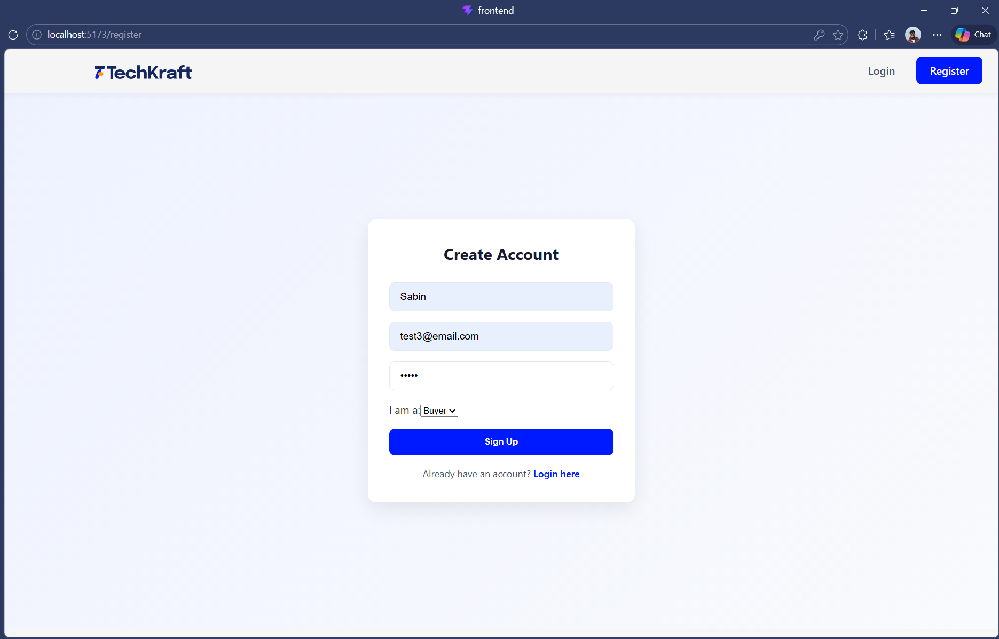
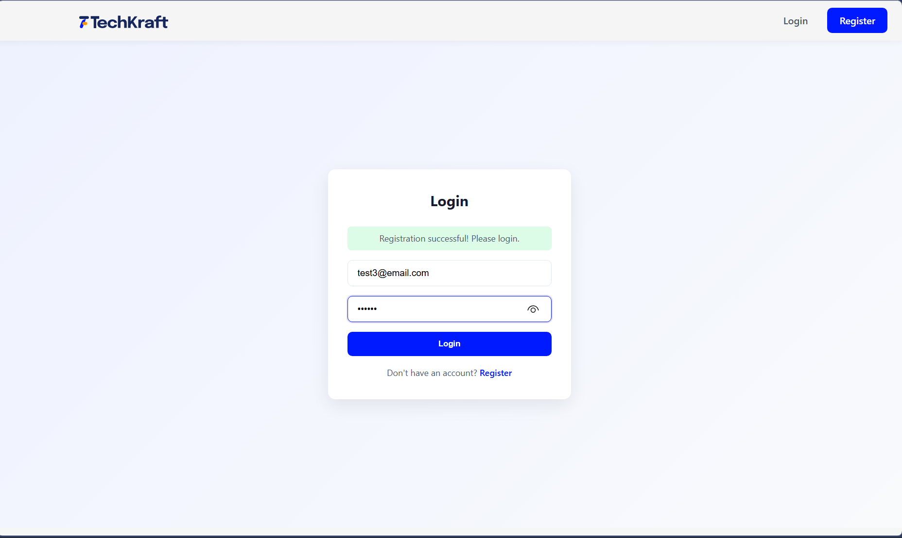
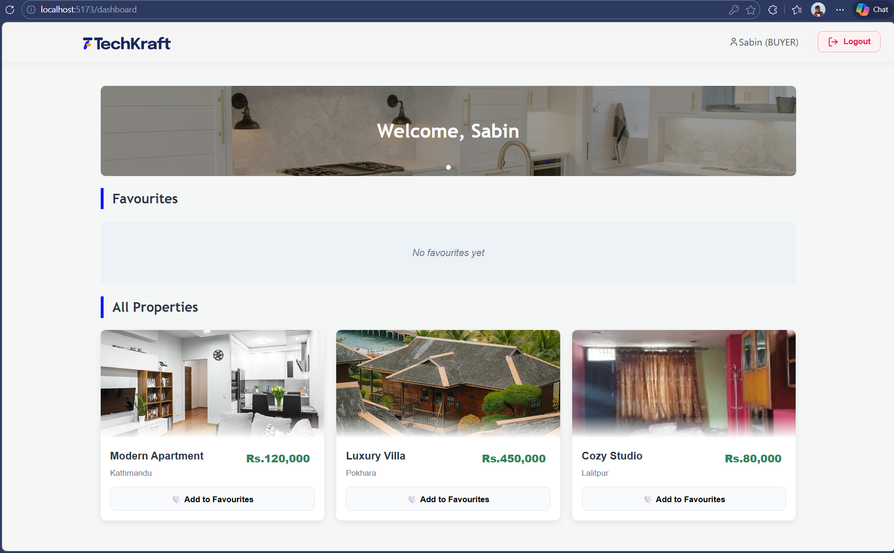
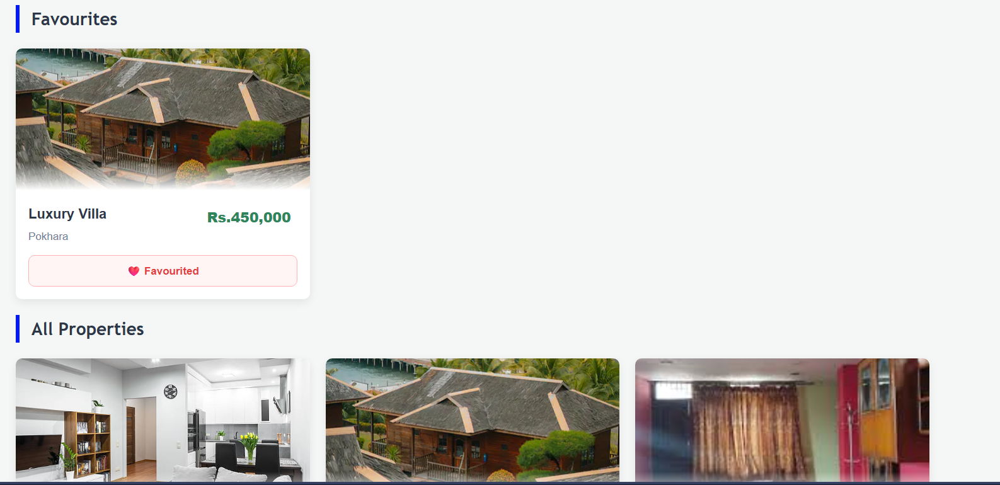

# Buyer Portal – Auth + Favourites

A full-stack real estate buyer portal built with **React + Vite** (frontend) and **Express + Prisma + SQLite** (backend).

Users can register, log in, browse properties, and manage their personal favourites list.

---

## Tech Stack

| Layer    | Technology                        |
|----------|-----------------------------------|
| Frontend | React 19, Vite, React Router v7, Axios |
| Backend  | Node.js, Express 5, Prisma ORM    |
| Database | SQLite (via Prisma)               |
| Auth     | JWT (jsonwebtoken) + bcrypt       |

---

## Project Structure

```
/
├── backend/
│   ├── config/          # Prisma client instance
│   ├── controllers/     # Route handler logic
│   ├── middleware/       # JWT auth middleware
│   ├── data/            # Stores property data as a json file
│   ├── routes/          # Express routers
│   ├── services/        # Business logic
│   ├── data/            # properties.json (static property data)
│   ├── prisma/          # Schema and migrations
│   ├── img/             # Served property images
│   ├── app.js
│   ├── server.js
│   └── .env
└── frontend/
    ├── src/
    │   ├── api/         # Axios instance
    │    ├── components/  # Navbar, PropertyCard, Hero
    │    ├── context/     # AuthContext
    │    └── pages/       # Login, Register, Dashboard
    ├── App.jsx
    └── main.jsx  

    
```

---

## Getting Started

### Prerequisites

- Node.js v20+
- npm

---

### 1. Clone the repo

```bash
git clone https://github.com/Sabin-Dahal/techkraft-task.git
cd techkraft-task
```

---

### 2. Set up the backend

```bash
cd backend
npm install
```

Create a `.env` file in the `backend/` folder:

```env
DATABASE_URL="file:./dev.db"
JWT_SECRET=add_a_secret_key_here
JWT_EXPIRES_IN=1d
```

Run the database migration:

```bash
npx prisma migrate deploy
```

Start the backend server:

```bash
npm install
npx prisma generate
npx prisma migrate deploy
node server.js
```

The API will be running at `http://localhost:5000`.

---

### 3. Set up the frontend

Open a second terminal:

```bash
cd frontend
npm install
npm run dev
```

The app will be running at `http://localhost:5173`.

---

## Example Flows

### Sign up → Login → Add a Favourite

1. Go to `http://localhost:5173/register`
2. Fill in your name, email, password, and select role **Buyer**
3. You'll be redirected to the login page with a success message
4. Log in with your credentials — you'll land on the Dashboard
5. Browse **All Properties** and click **🤍 Add to Favourites** on any property
6. The property appears instantly in the **Favourites** section at the top

### Remove a Favourite

1. On the Dashboard, find a favourited property (shown with ❤️)
2. Click the button to remove it — it disappears from the Favourites section immediately

### Logout

- Click **Logout** in the navbar — you'll be redirected to the login page
- Accessing `/dashboard` without a token redirects back to `/login`

---

## API Endpoints

### Auth

| Method | Endpoint             | Description         | Auth required |
|--------|----------------------|---------------------|---------------|
| POST   | `/api/auth/register` | Register a new user | No            |
| POST   | `/api/auth/login`    | Login, returns JWT  | No            |

### Properties

| Method | Endpoint              | Description           | Auth required |
|--------|-----------------------|-----------------------|---------------|
| GET    | `/api/properties`     | List all properties   | Yes           |
| GET    | `/api/properties/:id` | Get single property   | Yes           |

### Favourites

| Method | Endpoint              | Description                        | Auth required |
|--------|-----------------------|------------------------------------|---------------|
| GET    | `/api/favourites`     | Get current user's favourites      | Yes           |
| POST   | `/api/favourites/:id` | Add property to favourites         | Yes           |
| DELETE | `/api/favourites/:id` | Remove property from favourites    | Yes           |

---

## Database Design
 
The app uses two tables backed by SQLite via Prisma.
 
```
User
─────────────────────────────
id          INT   PK
name        TEXT
email       TEXT  UNIQUE
password    TEXT  (bcrypt hashed)
role        ENUM  (BUYER | SELLER)
 
Favourite
─────────────────────────────
id          INT   PK
userId      INT   FK → User.id  (CASCADE DELETE)
propertyId  INT   (references properties.json)
 
UNIQUE(userId, propertyId)
```
 
**Key design decisions:**
- `email` is unique — no duplicate accounts
- `UNIQUE(userId, propertyId)` — a user cannot favourite the same property twice
- `CASCADE DELETE` — deleting a user automatically removes their favourites
- `propertyId` references the static `data/properties.json` rather than a database table — properties are fixed seed data for this scope, so a separate table was not necessary
 
---
 
## Screenshots
 Register

Login

Buyer Dashboard

Favourites

 
---

## Security Notes

- Passwords are hashed with **bcrypt** (salt rounds: 10) — never stored in plain text
- JWTs are verified on every protected route via the `protect` middleware
- Favourites are scoped to the authenticated user — users cannot access or modify each other's data